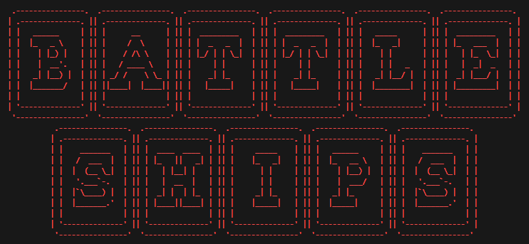
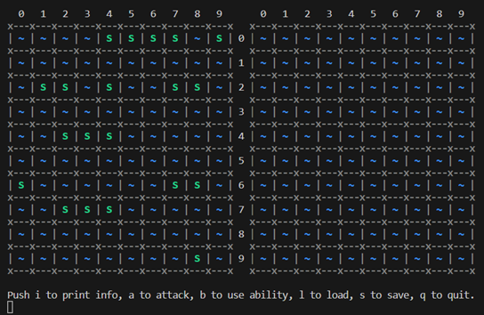
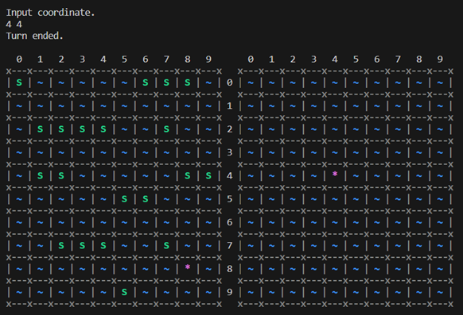
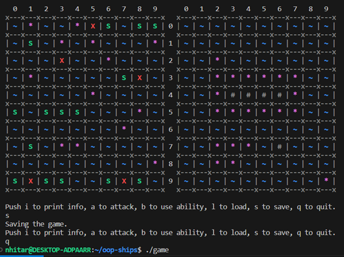
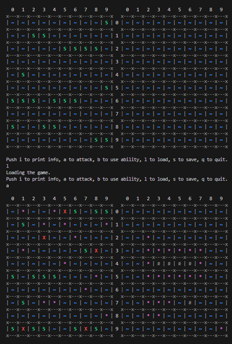
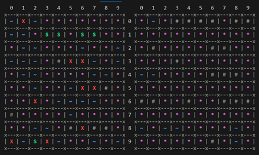
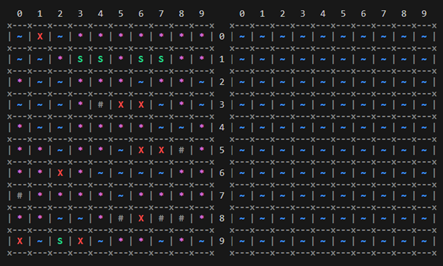

# OOP Battle Ships

CLI реализация игры `Морской бой` в рамках учебной дисциплины ООП.

## Установка и запуск

Клонирование репозитория:

```bash
git clone https://github.com/nhitar/oop-ships.git
cd oop-ships
```

Компиляция и запуск:

```bash
make game
./game
```

## Управление

Управление можно изменить через файл `setup.json`.

Стандартные настройки:

- `i` - вывод информационной справки по командам;
- `a` - атака заданного вражеского поля;
- `b` - использование случайной способности;
- `l` - загружает игру из файла `savefile.json`;
- `s` - сохраняет игру в файл `savefile.json`;
- `q` - выход из игры в терминал.

## Способности

- Двойной урон - моментальное уничтожение ячейки корабля при попадании;

- Сканер - подсказка о нахождении корабля противника в квадрате 2x2;

- Случайное попадание - попадение по случайной ячейке вражеского корабля без его раскрытия.

## Демонстрация игры

`Лого игры`:



`Начало игры`:



`Атака клетки врага`:



`Сохранение игры`:



`Загрузка игры`:



`Победа игрока`:



`Рестарт бота после победы`:


